# Проект: освоение Linux на платформе Stepik

В данном проекте описан процесс выполнения внешнего курса «Введение в Linux» (https://stepik.org/course/73/). Курс состоит из трёх этапов, каждый из которых включает теоретические материалы, практические задания и контрольные вопросы. Ниже представлены подробные отчёты о прохождении каждого этапа с иллюстрациями из личного кабинета.

---

## Этап 1. Введение

### Цель работы

Целью данной работы является выполнение внешнего курса под названием "Введение в Linux".

### Задание

1. Ознакомиться с теоретическим материалом
2. Ответить на вопросы и выполнить задания для закрепления теоретического материала

### Выполнение лабораторной работы

#### Выполнение 1.1. Общая информация о курсе

В первом подблоке этого этапа представленны наипростейшие задания, которые не требуют пояснений и служат только ради того, чтобы ознакомить нас со структурой курса.

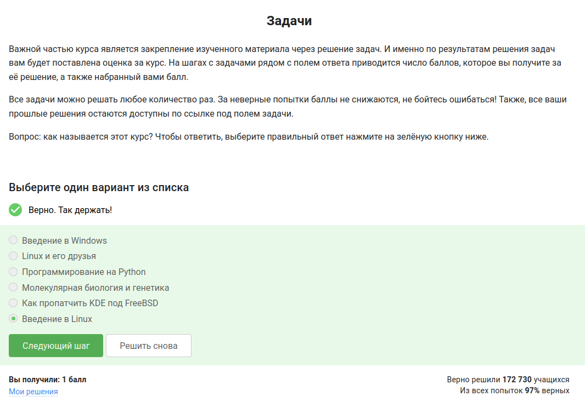

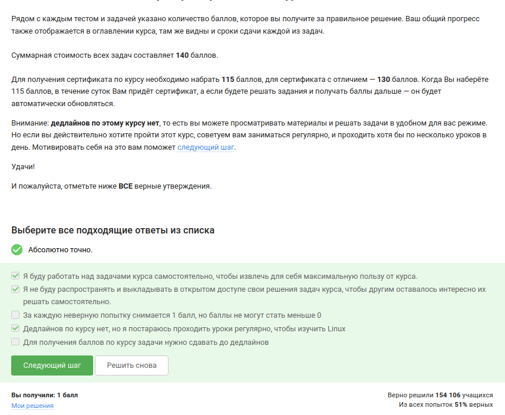

#### Выполнение 1.2. Как установить Linux

Аналогично с первым подблоком, во втором представленны наипростейшие задания, которые не требуют пояснений

#### Выполнение 1.3. Осваиваем Linux

Создали документ в LibreOffice Writer и написали в нём шрифтом FreeMono строчку: Hello, Linux!

После этого сохранили этот документ в формате FODT и загрузили в форму.

Установочные пакеты в Linux (Ubuntu) имеют расширение .deb.

Запустили плеер VLC, открыли Help → About, зашли во вкладку Authors.

Первая фамилия - Denis-Courmont. Ввели её на сайте.

Update Manager отвечает именно за обновление пакетов до актуальных версий, обновление всей системы до новой версии и ссылок в Software Center, но не устанавливает новые программы и не удаляет существующие.

#### Выполнение 1.4. Командная строка: основные понятия и простые команды

Синонимами «командной строки» являются «терминал» и «консоль». Слово «термин» означает научное понятие, а «Ассоль» — имя литературного персонажа, поэтому они не подходят.

Linux чувствителен к регистру, поэтому варианты "Pwd" или "PWD" некорректны. Правильный ответ: «Только pwd».

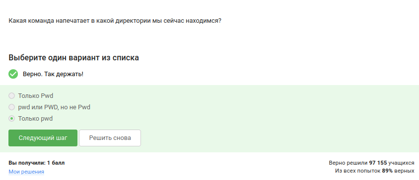

Следующая задача требовала найти команды, эквивалентные "ls -A --human-readable -l /some/directory". Были отмечены варианты, где "-A" (или "--almost-all"), "-h" (или "--human-readable"), "-l" комбинируются в любом порядке.

При нахождении в "/home/bi/Documents" команда "ls ~/Downloads" показывает содержимое папки Downloads домашнего каталога, так как "~" раскрывается в "/home/bi". Команда "ls ../Downloads" (подняться на уровень выше и зайти в Downloads) также корректна, а абсолютный путь "ls /home/bi/Downloads" работает из любой директории. Все варианты дают одинаковый результат, поэтому отмечены все.

Для удаления директорий используется "rm -r", где операнд "-r" (recursive) указывает на рекурсивное удаление содержимого. Команда "rm -f" только принудительно удаляет файлы без запроса, но не каталоги; "mv" перемещает, "mkdir" создаёт директории.

#### Выполнение 1.5. Запуск исполняемых файлов

Если ввести в терминал команду firefox (для запуска одноименного браузера), а затем ввести туда же команду exit, то ни одна из программ не закроется.

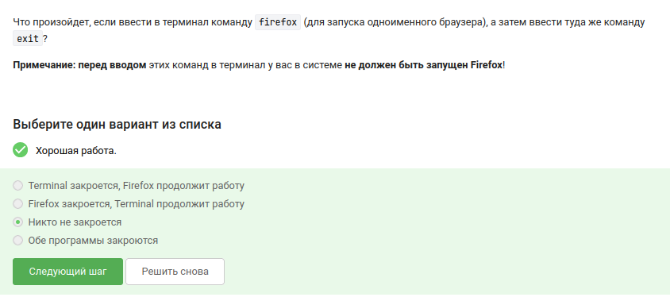

Запуск программы с символом "&" эквивалентен комбинации: запуск в фоне с помощью "Ctrl+Z" и последующей команды "bg". "Ctrl+Z" приостанавливает процесс, а "bg" возобновляет его в фоновом режиме. Остальные варианты либо оставляют процесс на переднем плане, либо завершают его.

Далее требовалось скачать файл с программой, сделать его исполняемым ("chmod u+x"), запустить и скопировать вывод. После явного вызова интерпретатора "python3 ./lec1_frag4_current_time.py" скрипт выдал текущую дату и контрольную сумму. Полученный результат ввели в ответ.

#### Выполнение 1.6. Ввод / вывод

Поток ошибок (stderr) по умолчанию выводится на экран, смешиваясь с обычным выводом. Это позволяет сразу видеть сообщения об ошибках.

Чтобы создать файл "file.txt" и записать в него поток ошибок программы "program", нужно использовать "program 2> file.txt" (перезапись файла) или "program 2>> file.txt" (дозапись). Остальные варианты либо перенаправляют стандартный вывод, либо используют неверный синтаксис.

При объединении программ в конвейер (pipe) сообщения об ошибках всё равно выводятся на экран.

#### Выполнение 1.7. Скачивание файлов из интернета

В команде "wget -P /home/alex/Pictures -O 1.jpg http://example.com/example.jpg" операнд "-P" задаёт каталог для сохранения, а "-O" переопределяет имя файла. Несмотря на исходное имя "example.jpg", файл будет сохранён как 1.jpg. Поэтому правильный ответ – /home/alex/1.jpg.

Опция "-q" (или "--quiet") заставляет "wget" работать в тихом режиме, убирая все информационные сообщения.

Команда "wget -r -l 1 -A jpg" рекурсивно скачивает страницу и файлы по шаблону "*.jpg", но при этом также загружает html-страницы. Однако после завершения все файлы, не соответствующие маске "-A", удаляются. Поэтому остаются только jpg, а html удаляются.

#### Выполнение 1.8. Работа с архивами 

При распаковке "gzip" по умолчанию удаляет исходный архив, оставляя только распакованный файл, тогда как "zip" сохраняет и архив, и извлечённые файлы.

Создать архив из директории могут "tar" и "zip". "gzip" сжимает только отдельные файлы, не умея работать с директориями.

Для запаковки файлов в "my_archive.tar.bz2" программе "tar" требуется комбинация флагов "-cjf": "c" – создать архив, "j" – использовать bzip2, "f" – указать имя файла.

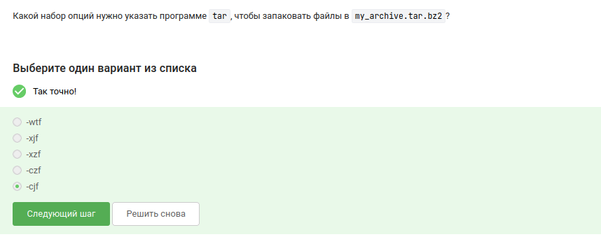

#### Выполнение 1.9. Поиск файлов и слов в файлах

В задании нужно было отметить те шаблоны, которые не найдут файл "Alexey.jpeg". Правильные ответы: "*.jpg" (ищет расширение ".jpg", а не ".jpeg"), "alexey.*" (имя начинается с маленькой буквы), "Alex" (без расширения) и другие, не соответствующие точному имени.

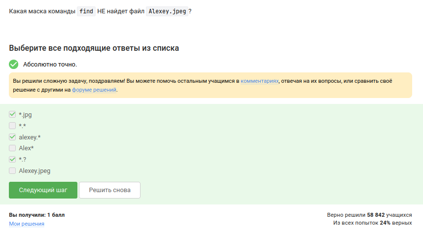

Команда "grep "world" text.txt" выводит строки, содержащие подстроку «world» с учётом регистра. Поэтому строки с «World», «WORLD» не попадают. Попадают: «The beautiful world is not enough», «The beautiful-world is not enough» (дефис не мешает), «The world is not enough», «world» (отдельно) и т.д. Строки с кавычками или словом «word» не содержат искомой подстроки.

Скачали архив произведений Шекспира, извлекли его ("tar -xf shakespeare.tar.gz") и собрать все строки, содержащие «love», в файл "slove.txt". Использовали команда "grep -rh "love" ~/Shakespeare > ~/slove.txt", где "-r" рекурсивно ищет, "-h" подавляет имена файлов. Полученный файл загружен в форму.

### Выводы

В ходе выполнения первого этапа внешнего курса «Введение в Linux» были получены базовые знания об операционной системе Linux, виртуальных машинах, пакетных менеджерах, работе с командной строкой, управлении процессами, потоками ввода-вывода, сетевых утилитах, архивации, поиске файлов и фильтрации текста

### Список литературы

1. Курс «Введение в Linux» на платформе Stepik [Электронный ресурс] URL: https://stepik.org/course/73/

---

## Этап 2. Работа на сервере

### Цель работы

Целью данной работы является выполнение внешнего курса под названием "Введение в Linux". Во втором этапе мы подробно изучим работу на сервере, установку программ и работу с процессами.

### Задание

1. Ознакомиться с теоретическим материалом
2. Ответить на вопросы и выполнить задания для закрепления теоретического материала

### Выполнение лабораторной работы

#### Выполнение 2.1. Знакомство с сервером

Сервер может служить для выполнения многих задач: хранение конфиденциальных или общедоступных данных, выполнение сложных вычислений, хранение больших объемов данных, поэтому все ответы верны.

Распространять можно только публичный ключ (id_rsa.pub), конфеданциальный ключ (id_rsa) никаким образом нельзя распространять.

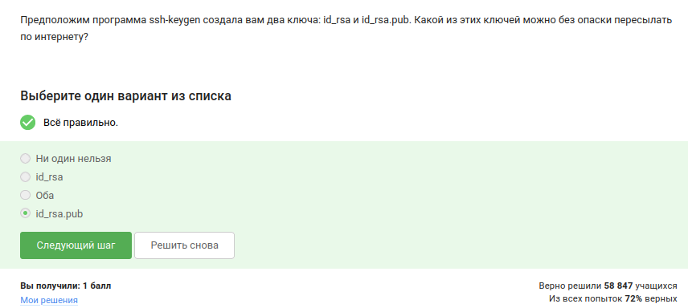

Для рекурсивного копирования папки "stepic" со всем содержимым на сервер в домашнюю директорию необходимо использовать ключ "-r". Поэтому верный ответ: "scp -r stepic username@server:~/".

#### Выполнение 2.2. Обмен файлами

Если "sudo apt-get install program" не находит пакет может помочь выполнить "sudo apt-get update" для обновления индексов репозиториев и проверить (восстановить) интернет-соединение. Команда "sudo apt-get upgrade" обновляет уже установленные пакеты, но не решает проблему поиска нового пакета, а "--only-upgrade" лишь обновляет существующую программу.

Filezilla позволяет просматривать и копировать содержимое каталогов как на локальном компьютере, так и на сервере, однако не предназначен для установки или запуска программ.

Если на сервере необходимо запустить программу, рассчитанную на графический интерфейс, можно либо поискать её терминальную версию, либо настроить проброс графического вывода.

#### Выполнение 2.3. Запуск приложений

Утилиты "help", "man" и вызов "program --help" (или "-h"/"-help") являются стандартными способами получения документации в Linux. Конструкция "program ?!" синтаксически неверна и никогда не используется.

Программа FastQC принимает на вход форматы fasta и fastq. Это было выяснено после изучения справки ("fastqc --help"), где явно перечислены поддерживаемые типы файлов.

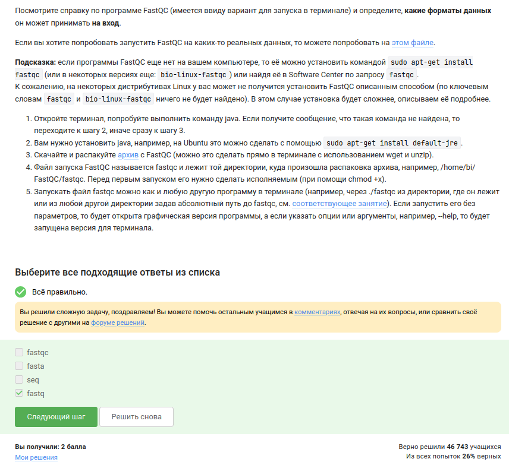

Для выполнения множественного выравнивания программой ClustalW необходимо явно указать опцию "-align". Полная команда: "clustalw test.fasta -align".

#### Выполнение 2.4. Контроль запускаемых программ

После выполнения последовательности действий с фоновыми процессами ("fg %1", "Ctrl+C", "fg %2", "Ctrl+Z") команда "jobs" покажет только процессы, которые остались в фоне или остановлены. "program1" была снята с паузы и затем завершена, "program2" остановлена комбинацией "Ctrl+Z", а "program3" по-прежнему работает в фоне. Следовательно, "jobs" отобразит информацию о "program2" и "program3".

Утилиты "jobs", "top" и "ps" используют разные идентификаторы: "jobs" оперирует номерами заданий текущего сеанса оболочки, "ps" – системными PID (Process ID), а "top" также показывает PID. Поэтому ни в одной паре они не совпадают. Верный ответ – «У всех разные».

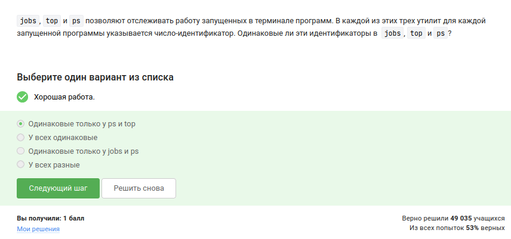

Мгновенно завершить остановленный процесс можно командой "kill -9", посылающей сигнал SIGKILL.

Сигнал "kill" (без опций) лишь просит процесс завершиться, но не действует на процесс, пока тот не будет продолжен.

#### Выполнение 2.5. Многопоточные приложения

В остановленном состоянии процессорное время не потребляется, поэтому "%CPU" равен нулю.

Занятая память сохраняется в том же объёме, что и в момент остановки.

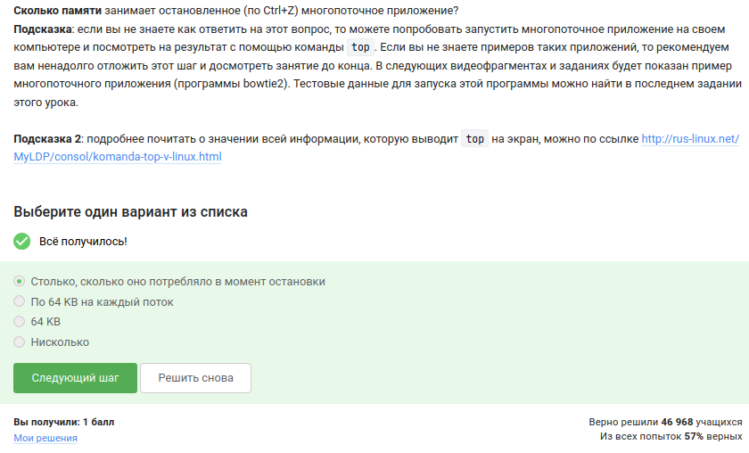

Невозможно принудительно завершить отдельный поток многопоточного приложения – в Linux сигналы посылаются всему процессу целиком, поэтому «никак» является единственно верным ответом.

Многопоточность поддерживается только на этапе собственно выравнивания (подпрограмма "bowtie2"). Этап индексации референсного генома ("bowtie2-build") выполняется строго в один поток.

Вывод stderr второго этапа был перенаправлен в файл "bowtie.log" и загружен в форму.

#### Выполнение 2.6. Менеджер терминалов tmux

Каждая вкладка представляет собой независимую сессию оболочки. Если процесс был приостановлен в другой вкладке, набрав "fg" в текущей, терминал сообщит, что нет подходящей задачи, так как "fg" видит только задания своей сессии.

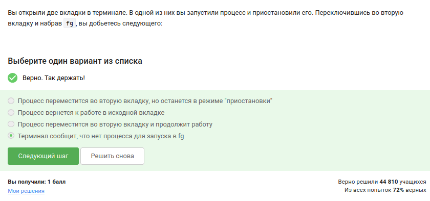

Если в tmux осталась одна последняя вкладка и в ней введена команда "exit", то tmux завершает свою работу, поскольку закрывается последняя активная сессия.

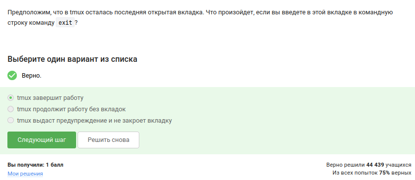

В описанной ситуации соединение с сервером прервётся, однако tmux продолжит работу. Tmux является серверным процессом, не привязанным к конкретной SSH-сессии; при разрыве соединения его сессия остаётся активной, и к ней можно снова подключиться позже.

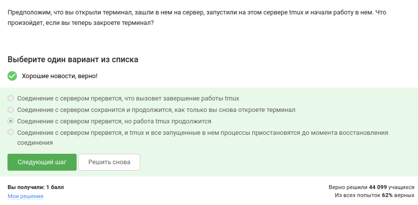

При принудительном закрытии вкладки tmux ("Ctrl+B, X") все процессы, запущенные в этой вкладке, уничтожаются.

Для переименования текущей вкладки в tmux используется комбинация "Ctrl+B" и запятая (",").

Изучили возможности разделения вкладок на панели. Из предложенных утверждений верными являются два: "По половинкам "разделенной" вкладки можно перемещаться при помощи (Ctrl+B и стрелочек)", "Команды-"разделения" действуют только в текущей вкладке tmux, а не во всех вкладках одновременно", "Можно закрыть одну из "частей" вкладки выполнив (Ctrl+B и x)". Остальные утверждения неверны.

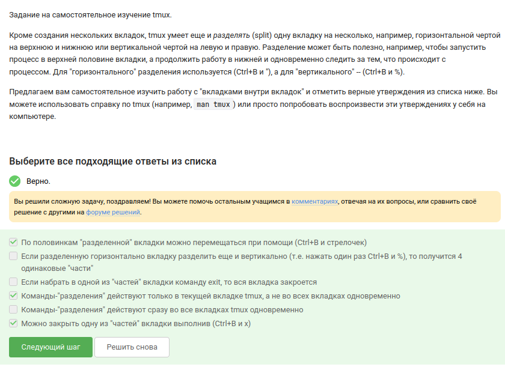

### Выводы

В ходе выполнения второго этапа внешнего курса «Введение в Linux» были получены практические навыки работы с удалёнными серверами, установкой программного обеспечения, запуском и контролем процессов

### Список литературы

1. Курс «Введение в Linux» на платформе Stepik [Электронный ресурс] URL: https://stepik.org/course/73/

---

## Этап 3. Продвинутые темы

### Цель работы

Целью данной работы является выполнение внешнего курса под названием "Введение в Linux". В третьем этапе мы подробно редактор vim, скрипты bash и различные возможности Linux.

### Задание

1. Ознакомиться с теоретическим материалом
2. Ответить на вопросы и выполнить задания для закрепления теоретического материала

### Выполнение лабораторной работы

#### Выполнение 3.1. Текстовый редактор vim

Чтобы выйти из редактора vim необходимо нажать  " : ", затем "q", затем "Еnter". Именно так осуществляется выход из нормального режима vim.

Далее необходимо было изучить разнице между использованием "W" и "w" в редакторе vim. W служит перемещению между условно называемых больших слов - слова раделенные исключительно пробелом. Использование w служит для перемещению между условно называемых маленьких слов - слова делятся всеми символами, кроме нижнего подчеркивания, при этом сомволы тоже считаются маленькими словами. На примере строки "Strange_  TEXT  is_here. 2=2 YES!" мы можем увидеть, что больших слов здесь всего 5 ("Strange_", "TEXT", "is_here.", "2=2", "YES!"), а маленьких 9 ("Strange_", "TEXT", "is_here", ".", "2", "=", "2", "YES", "!"). Логически выбрали правильные ответы: "Нажимая только на W, нельзя переместить курсор на "."", "После 10 нажатий на W курсор окажется там же, где бы он был после 10 нажатий на w", "Чтобы попасть в конец строки, нужно совершить меньше нажатий на W, чем на w".

В текстовом файле записана одна единственная строка: "one two three four five" и нужно преобразовать её в строку "three four four four five". Для этого подходят команды:  "ddithree four four four five<<Esc>>" (удаление всей строки и вставка нового текста), "d2wwywPp" (удаление двух первых слов, переход к слову «four», его копирование и вставка перед и после курсора), "d2w$$bifour four <<Esc>>" (удаление двух слов, переход в конец строки и вставка «four four » перед последним словом), "d2wwifour four <<Esc>>" (удаление двух слов, переход к «four» и вставка перед ним).

Чтобы в редакторе vim заменить в некотором файле все строки, содержащие слово Windows, на такие же строки, но со словом Linux, при этом если в какой-то строке слово Windows встречается больше, чем один раз, то заменить на Linux в этой строке нужно только самое первое из этих слов нужно выполнить команду ":%s/Windows/Linux". Без дополнительных флагов замена в vim затрагивает только первое совпадение на строке.

При самостоятельном изучении режима выделения были отмечены верные утверждения: "Режим выделения открывается из нормального режима по нажатию "v"", "В режиме выделения можно использовать команды d (удалить) и y (скопировать)", "В режиме выделения можно использовать команды перемещения (например, W, e, $, и др.)", "Выйти из режима выделения можно, нажав клавишу Esc два раза".

#### Выполнение 3.2. Скрипты на bash: основы

Если из bash запущена sh, а из неё снова bash, то стрелки вверх/вниз показывают только команды, набранные в текущей (последней) оболочке. Поэтому доступен только набор C.

Скрипт создаёт файл в "/home/bi/", поэтому абсолютный путь к "file1.txt" будет "/home/bi/file1.txt".

Имена переменных в bash могут содержать буквы (в том числе заглавные), цифры (не на первом месте) и знак подчёркивания. Поэтому из предложенного списка допустимыми являются "VARIable", "variable", "__variable", "variable_123" и "variable123". Строки "var i able" и "123variable" не удовлетворяют синтаксису.

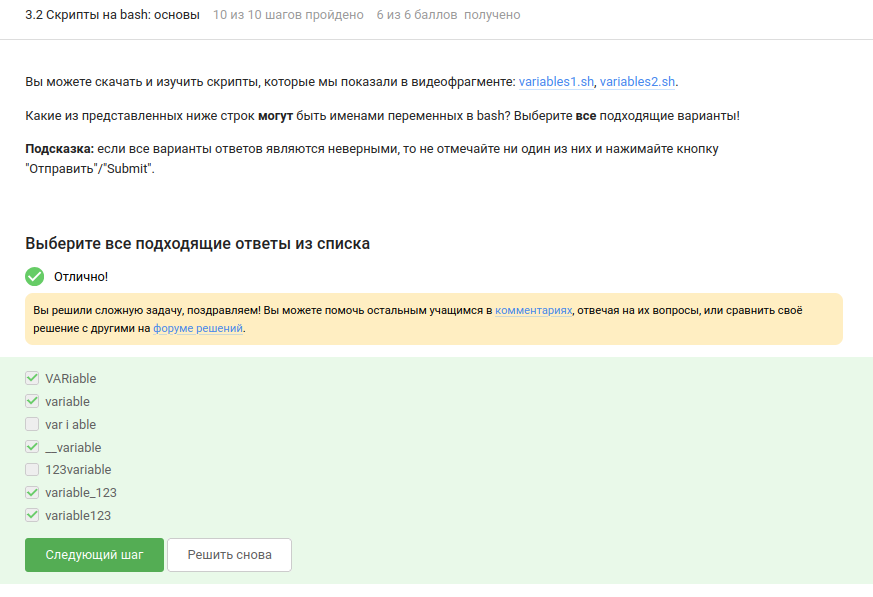

Для вывода аргументов был написан скрипт, использующий "$1" и "$2". При запуске "./script.sh one two" он печатает "Arguments are: $1=one $2=two".

(Листинг скрипта удалён для сохранения форматирования.)

#### Выполнение 3.3. Скрипты на bash: ветвления и циклы

Cреди условий, всегда истинных вне зависимости от аргументов, были отмечены: "!(4 -le 3)" (логическое отрицание ложного утверждения), "$# -ge 0" (число аргументов всегда неотрицательно), "-e $0" (файл скрипта существует), "-n $0" (имя скрипта непусто), "-z """ (пустая строка имеет нулевую длину) и "5 -ge 5". Все они гарантированно возвращают истину.

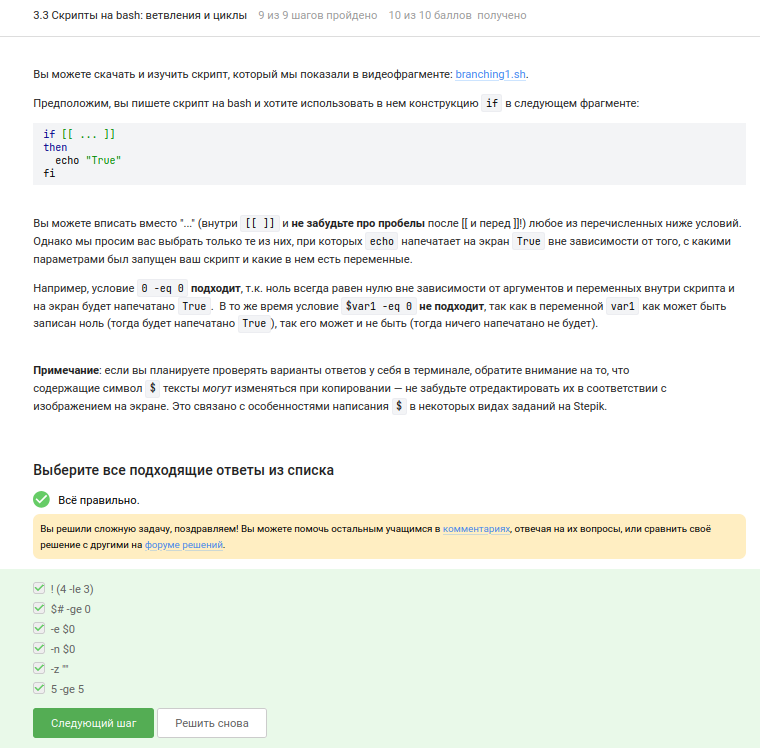

Фрагмент с "if‑elif‑else" при "var=3" и "var=5" оба раза попадает в ветку "else", выводя "four". Таким образом, на экране сначала "four", потом "four".

Был реализован скрипт, который по числу студентов выводит правильную форму: 0 → «No students», 1 → «1 student», 2–4 → «N students», от 5 и больше → «A lot of students». Решение использовало цепочку "if‑elif‑else".

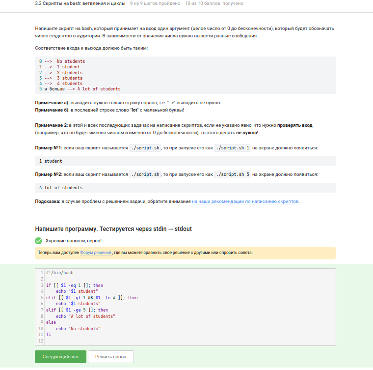

(Листинг скрипта удалён.)

В цикле "for str in a, b, c_d" слово "start" выводится пять раз (согласно логике задания), а "finish" - 4.

Задача с бесконечным циклом опроса имени и возраста решена при помощи вложенных "while" и проверок на пустой ввод или нулевой возраст. Скрипт корректно обрабатывает граничные условия и выходит по команде «bye».

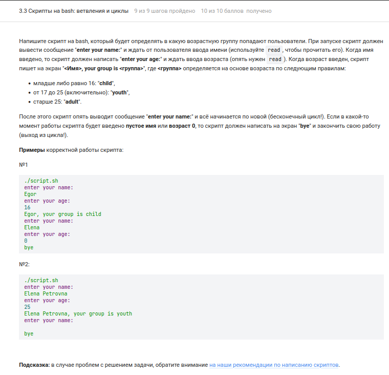

(Листинг скрипта удалён.)

#### Выполнение 3.4. Скрипты на bash: разное

Увеличить переменную "a" на значение "b" можно с помощью "let a=a+b", "let "a = a + b"", "let "a+=b"" и "let "a=$a+$b"". Прямое присваивание "a=$a+$b" без "let" лишь соединяет строки.

Скрипт, содержащий "cd /home/bi/" и "echo "\"pwd\""", выводит "/home/bi", так как подстановка команды в обратных кавычках выполняется после смены каталога.

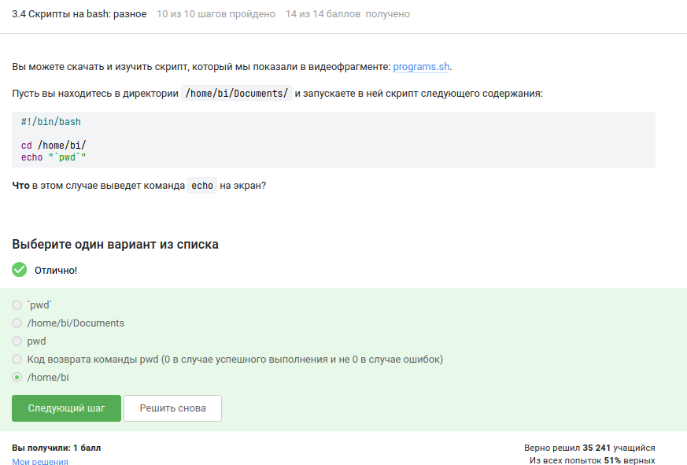

Для проверки кода возврата программы, которая пишет в stdout, нужно сначала выполнить её, затем if [[ $? -eq 0 ]] или же создать условие if "program > some_file.txt".

Функция "counter" с локальной переменной "c1" не изменяет глобальную переменную с тем же именем. После десяти вызовов "c2" становится равной 110, а "c1" остаётся пустой, поэтому "echo" выводит "counters are  and 110".

Написан скрипт для вычисления НОД с помощью рекурсивной функции "gcd", реализующей алгоритм Евклида. Скрипт ожидает ввода двух натуральных чисел, выводит результат и завершается по пустой строке словом «bye».

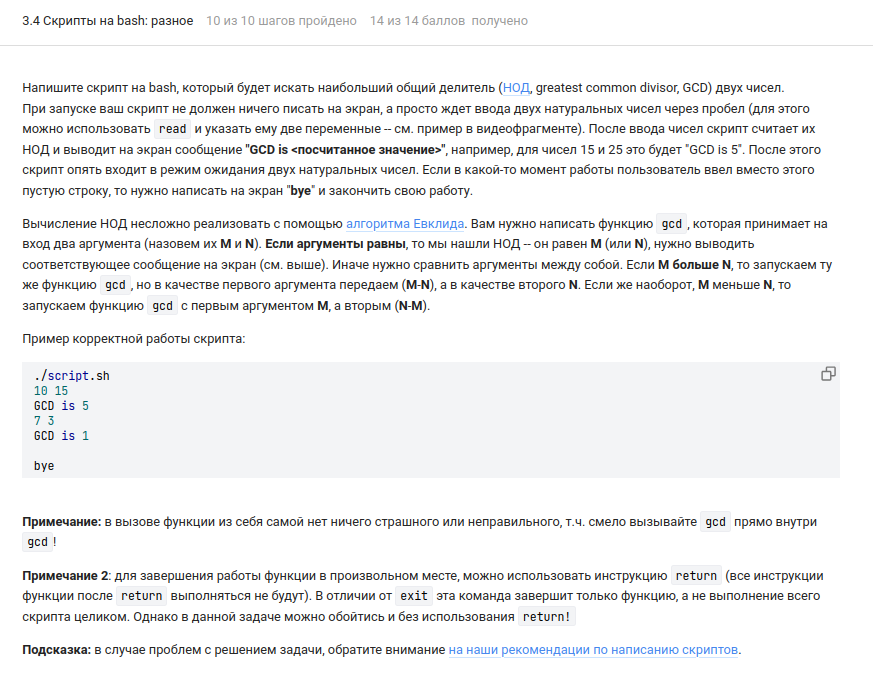

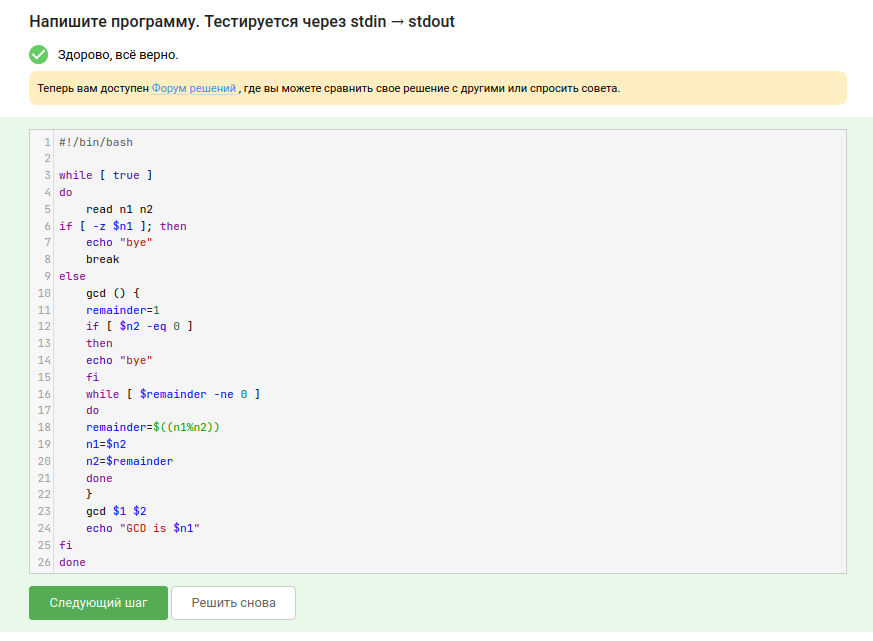

(Листинг скрипта удалён.)

Реализован калькулятор на bash, поддерживающий операции "+", "-", "*", "/", "%", "**" и команду "exit". При некорректном вводе выводится "error", и скрипт завершается.

(Листинг скрипта удалён.)

#### Выполнение 3.5. Продвинутый поиск и редактирование

Команда "find -iname "star*"" находит больше файлов, чем "find -name "star*"", так как игнорирует регистр. Из предложенного набора, которые найдет команда find /home/bi -iname "star*", но НЕ найдет команда find /home/bi -name "star*" оказались "Star_Wars.avi" и "STARS.txt".

Опции "-path" и "-name" не всегда взаимозаменяемы: в одних случаях "-name" находит меньше файлов, в других — больше, в зависимости от шаблона, поэтому верные утверждения "В некоторых случаях find с -name найдет меньше файлов, чем find с таким же запросом, но с -path", "В некоторых случаях find с -name найдет больше файлов, чем find с таким же запросом, но с -path".

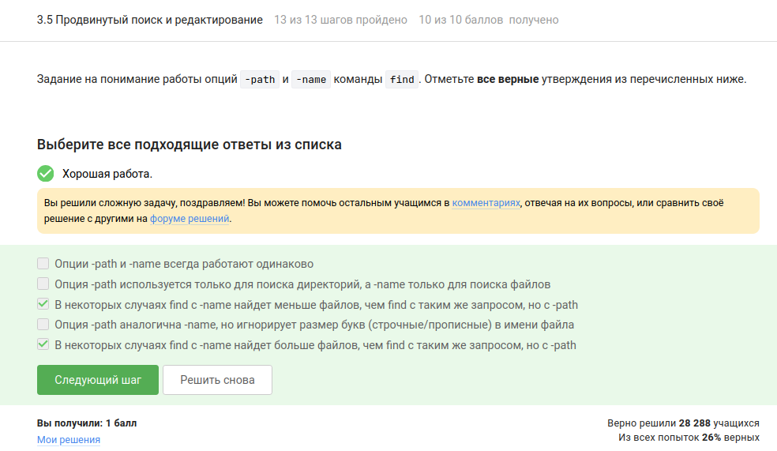

При структуре "/home/bi/", содержащей вложенные каталоги "dir1", "dir2", "dir3" с файлами "file1", "file2", "file3" соответственно, условие "-mindepth 2 -maxdepth 3" отсекает файлы, лежащие непосредственно в указанной директории (глубина 1). Под критерий попадают только файлы, расположенные на глубине 2 или 3. Таким образом, будут найдены "file1" и "file2", но не "file3".

При добавлении контекста ("-A", "-B", "-C") к поиску слова, которое присутствует в каждой строке файла, размер результирующего файла не изменяется. Во всех четырёх случаях "results.txt" будет одинакового размера.

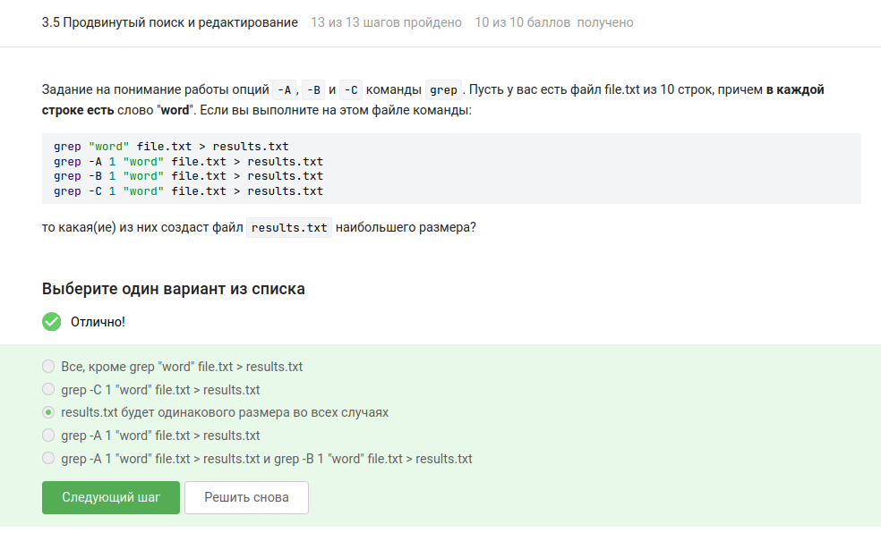

Регулярное выражение "[xklXKL]?[uU]buntu$" описывает строки, оканчивающиеся на "buntu" с возможной предшествующей буквой из набора. Единственная подходящая строка – "I prefer Kubuntu".

Если в "sed" опустить опцию "-n", каждая строка, попавшая под шаблон, будет напечатана дважды: один раз из‑за автоматического вывода, второй – по команде "p".

Для замены «аббревиатур» (две и более заглавные латинские буквы) на слово "abbreviation" в файле "input.txt" с записью результата в "edited.txt" использована команда "sed 's/[A-Z]\{2,\}/abbreviation /g' input.txt > edited.txt".

#### Выполнение 3.6. Строим графики в gnuplot

Для того чтобы графики не закрывались при выходе из gnuplot, используется опция "-p" или "--persist".

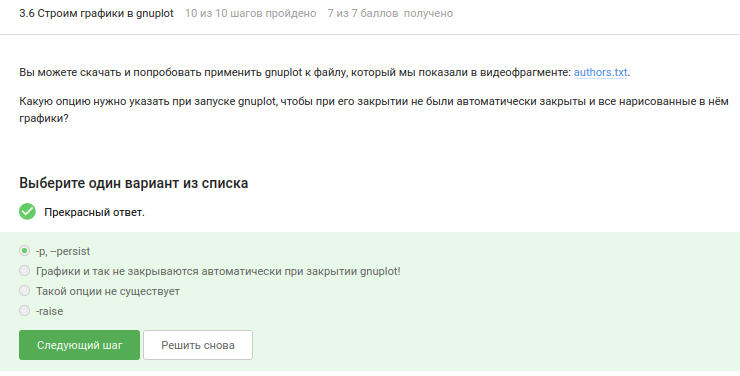

Когда "data.csv" не содержит заголовка, а задано "set key autotitle columnhead", первая строка используется как название кривой (второй столбец) и исключается из данных, поэтому на графике отображается 9 точек.

Для размещения на оси OX только трёх заданных делений с текстовыми метками используется команда "set xtics". Строки конкатенируются с помощью оператора ".". Правильный ответ: "set xtics ('point 1, value '.x1 x1, 'point 2, value '.x2 x2, 'point 3, value '.x3 x3)".

Файл "move.rot" был изменён для зеркального отражения ("splot -x**2-y**2"), вращения в обратную сторону ("zrot=(zrot+350)%360") и удвоения скорости ("pause 0.1"). Это позволило получить требуемую анимацию.

#### Выполнение 3.7. Разное

Для превращения прав "r--r--r--" в "rwxrw-r--" подходят последовательности "chmod u+wx file.txt; chmod g+w file.txt", "chmod ug+w file.txt; chmod u+x file.txt", "chmod 764 file.txt", "chmod a+wx file.txt; chmod o-wx file.txt; chmod g-x file.txt".

Чтобы пользователь из группы "group" мог создавать файлы в каталоге "dir", принадлежащем root, можно использовать: "sudo chmod o+w dir" (добавляет право записи для «остальных» пользователей, к которым относится и user), "sudo chown user:group dir" (меняет владельца и группу каталога на user и group, после чего user получает полный контроль как владелец), "sudo chmod a+w dir" (даёт право записи всем, что разрешает user создавать файлы), "sudo chown user dir" (меняет только владельца на user, после чего user как владелец может записывать файлы в каталог).

Утилита "wc" способна подсчитывать строки, слова, символы и длину самой длинной строки, но не количество конкретных букв.

Размер текущей директории в человеко‑читаемом формате выводится командой "du -h -s" (или "du -sh"). Ключ "-h" включает удобные единицы измерения, "-s" подводит итог.

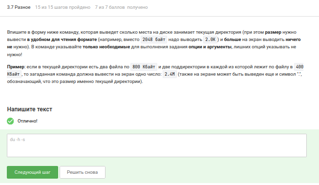

Наиболее короткая команда для одновременного создания трёх поддиректорий "dir1", "dir2", "dir3" : "mkdir dir{1..3}".

### Выводы

В ходе выполнения третьего этапа курса «Введение в Linux» были освоены продвинутые приёмы работы в vim, написание сценариев на bash с условными переходами и циклами, использование функций, регулярные выражения в grep и sed, построение и анимация графиков в gnuplot, а также ряд полезных утилит (wc, du, chmod)

### Список литературы

1. Курс «Введение в Linux» на платформе Stepik [Электронный ресурс] URL: https://stepik.org/course/73/

---

## Итоговое заключение

В результате выполнения всех трёх этапов курса были получены фундаментальные и практические знания об операционной системе Linux: от базовой работы в командной строке до написания сложных сценариев на bash, работы с удалёнными серверами, управления процессами, использования текстового редактора vim, фильтрации текста с помощью регулярных выражений и построения графиков в gnuplot. 

По оканчании курса был получен сетификат, подтверждающий прохождение курса

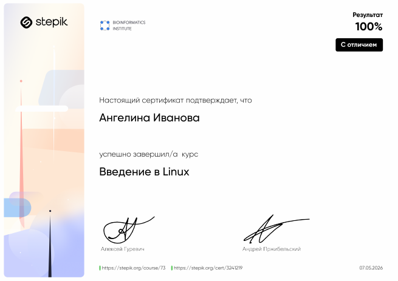
